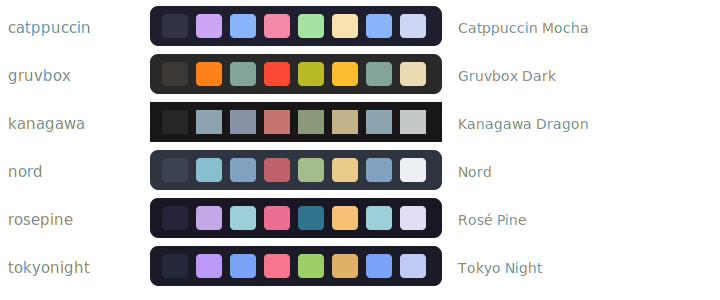

<p align="center"></p>

<p align="center"><a href="https://github.com/jackoregankenny/newmac/actions/workflows/ci.yml"></a></p>

# newmac — a fresh Apple Silicon Mac, your way

A reproducible, Homebrew-driven Mac setup with an **interactive picker**: run one
script, tick the tools you want (terminals, AI coding agents, menu bars, tiling
desktop, apps), and it installs and configures everything. Selections are saved, so
re-runs are non-interactive and the whole thing is idempotent.

Built for developer machines with a Linux-rice sensibility: Ghostty/Rio + Zellij,
Starship + Nerd Font, AeroSpace tiling + SketchyBar (or barik), JankyBorders,
proper ⌥-Tab window switching, Caps→⌘/Esc, battery tuning.

## Quick start (on the fresh Mac)

One line, nothing pre-installed (winutil-style):

```sh
bash -c "$(curl -fsSL https://raw.githubusercontent.com/jackoregankenny/newmac/main/get.sh)"
```

That clones to `~/newmac` (the permanent home the `newmac` command points at) and runs
the picker. To **always get the freshest `main` into `~/Downloads`** instead — a clean
clone every time, no CDN in the way — use the `install` entry point:

```sh
bash -c "$(curl -fsSL https://raw.githubusercontent.com/jackoregankenny/newmac/main/install)"
```

Or clone it yourself:

```sh
git clone https://github.com/jackoregankenny/newmac.git ~/newmac && cd ~/newmac
bash bootstrap.sh
```

### Keeping the install URL fresh

`git clone` (what `install` does) always fetches the latest `main` — there is no cache
to fight. The `curl … | bash` path fetches `get.sh`/`install` through GitHub's raw CDN,
which caches for ~5 minutes; append `?v=$(date +%s)` to force a fresh copy if you just
pushed a change. **For a website install button**, don't link raw — this repo ships a
GitHub Pages deploy (`.github/workflows/pages.yml`) that republishes the landing page
and a fresh copy of `install` on every push (Pages purges its cache each deploy), giving
you a stable, always-current URL like `https://jackoregankenny.github.io/newmac/install`.
Enable it once under **Settings → Pages → Source: GitHub Actions**.

That's it. Bootstrap installs Xcode CLT → Homebrew, then opens the picker. It's fully
**à la carte** — you walk each category and tick exactly what you want. Everything
starts at a sensible default (● on / ○ off); change anything, in any combination:

```
 ◆ Terminals  ·  step 1/18  2/7 selected
   ↑/↓ move · space toggle · a all · n none · enter continue
 ❯ ● Ghostty            Fast native GPU terminal — themed config included
   ● Rio                Light GPU terminal, RetroArch shaders
   ○ WezTerm            GPU terminal configured in Lua
   ○ Warp               AI-native terminal (account required)
   …
```

No bundles to commit to — the categories *are* the mix-and-match. (If you'd rather
skip the questions entirely, `--preset webdev` and friends still exist as one-shot
shortcuts — see below — but the interactive picker never makes you pick a bundle.)

The picker is pure bash (runs on the stock macOS shell, zero dependencies) and walks
through: **Terminals · Multiplexers · AI coding agents · Menu bar · Tiling & window
management · Dev runtimes · Apps · Fonts**, then asks about the tiling-desktop
configs, macOS UX defaults, power tuning, weekly auto-updates, and whether to
arrange the Dock to match your picks (via `dockutil`). Bootstrap also sets your git
identity (name/email + delta as pager) if it isn't configured yet.

### Optional: the Rust picker (nicer, searchable)

A compiled [ratatui](https://ratatui.rs) picker upgrades the bash checkbox screen with
a **Presets start screen** (pick a flavour like *Jack's flavour* / *Basic*, go
*Custom*, or keep your current selection), **fuzzy search across every tool**, inline
**warning badges** (`paid` / `account` / `large` / `App Store`), a **live theme
preview**, **mouse support**, and a **browse / add popular Homebrew** screen (works
offline, or `r`efresh live). It writes the exact same `newmac.conf`, so it's a
drop-in — and on a fresh Mac `bootstrap.sh` downloads a prebuilt binary, so it's the
**first-run** experience with no cargo needed. Flavours live in `flavours/*.toml` —
adding your own is a one-file PR (see [CONTRIBUTING.md](CONTRIBUTING.md)).

```sh
newmac ui            # download the prebuilt binary → ~/.local/bin/newmac-ui
newmac ui --build    # or compile from source (needs cargo)
newmac configure     # opens the Rust picker; bash stays the fallback
```

The catalog is a canonical `catalog.toml`; `scripts/catalog.sh` is generated from it.
See [`ui/README.md`](ui/README.md) for the architecture, dev tasks, and how releases
are cut.

Other modes:

```sh
bash bootstrap.sh --defaults        # no questions — sensible defaults
bash bootstrap.sh --preset webdev   # a ready-made stack, no questions
bash bootstrap.sh --reconfigure     # change selections, then install the diff
bash scripts/install.sh --dry-run   # preview exactly what would be installed
```

## What's on the menu

| Category | Options (✓ = default) |
|---|---|
| **AI coding agents** | ✓ Claude Code · ✓ Codex · ✓ Factory Droid · ✓ opencode · Amp · Kimi Code · Crush · Goose · Cursor CLI · Copilot CLI · Aider · Qwen Code · Gemini CLI |
| **Terminals** | ✓ Ghostty · ✓ Rio · WezTerm · Alacritty · kitty · Warp · iTerm2 |
| **Agent workbenches** | ✓ Orca · ✓ cmux · Conductor · Nimbalyst (+ Superconductor by direct download) |
| **Multiplexers** | ✓ Zellij · ✓ tmux |
| **Menu bar** | ✓ SketchyBar · ✓ Stats · barik (modern SwiftUI bar) · Ice (hide/manage icons) |
| **Tiling / windows** | ✓ AeroSpace · ✓ JankyBorders · ✓ AltTab · ✓ Karabiner · ✓ Raycast · DockDoor · yabai · Amethyst · Rectangle · Loop |
| **Runtimes** | ✓ Bun · ✓ Node (fnm) · ✓ uv · ✓ Go · ✓ Rust (rustup) · ✓ Docker+Colima · OrbStack |
| **Dev apps** | ✓ VS Code · Cursor · Zed · GitHub Desktop · TablePlus · Bruno · Postman · UTM · Xcode (App Store) |
| **Browsers** | ✓ Dia · Arc · Chrome · Firefox · Brave · Zen · Edge |
| **Productivity** | ✓ 1Password + `op` CLI · ✓ coconutBattery · Obsidian · Notion · Figma · Linear · Todoist · Keka · Shottr · Amphetamine (App Store) |
| **Office & work** | ✓ Teams · ✓ Outlook · ✓ Word · ✓ Excel · ✓ PowerPoint · OneDrive · LibreOffice · OnlyOffice |
| **Comms & media** | Slack · Discord · Zoom · WhatsApp · Telegram · Spotify · IINA · VLC |
| **Network & VPN** | ✓ Cloudflare WARP · ✓ Tailscale · Mullvad · Proton VPN · WireGuard tools |
| **Local AI** | Ollama · LM Studio |
| **Maintenance** | ✓ Mole (`mo`) · ✓ mas · ✓ dust · ✓ duf · Topgrade · Pearcleaner · OnyX |
| **Fonts** | ✓ JetBrains Mono NF · ✓ Symbols NF · Fira Code NF · Meslo NF · Monaspace |

Core shell tooling is always installed: starship, zoxide, fzf, eza, bat, ripgrep, fd,
delta, zsh plugins, git/gh, jq/yq, btop, macmon.

**New here? Read [the guide](docs/GUIDE.md)** — install to daily driving, the tiling
workflow, themes, and troubleshooting. **The full index — every tool, its exact
install command, every preset and theme — is auto-generated in
[docs/CATALOG.md](docs/CATALOG.md)** (regenerate with `bash scripts/docs.sh`).

## Themes

<p></p>

The whole rice — terminal, bar, borders, prompt — is themed from one palette
(kanagawa is the sharp-cornered one, as the swatches show). Preview with
`newmac theme` (live swatches in the terminal), pick in the TUI, or switch any time:

```sh
bash scripts/theme.sh rosepine     # tokyonight (default) · rosepine · nord · gruvbox · catppuccin
```

Themes live in `config/themes/*.sh` (10 colour variables each); adding one file adds
it to the picker. `theme.sh` regenerates `~/.config/newmac/theme.sh`, points Ghostty at
the matching built-in theme, updates the starship palette, and reloads
sketchybar/borders live.

## How it works

- **`scripts/catalog.sh`** — single source of truth. Every installable item is one
  line: `id|category|kind|default|payload|name|description`. Kinds: `brew`, `cask`
  (taps auto-derived), `curl` (vendor script), `npm` (via bun), `uv`, `rustup`.
  **Adding a tool for everyone = adding one line here.**
- **`scripts/tui.sh`** — dependency-free checkbox picker (arrow keys, space, works on
  bash 3.2 so it runs before anything is installed).
- **`scripts/configure.sh`** — walks the catalog, writes **`newmac.conf`**
  (git-ignored; your machine's selection lives there and re-runs pre-select from it).
- **`scripts/install.sh`** — generates a Brewfile from your selection, runs
  `brew bundle`, then handles rustup / npm / uv / vendor installers. Idempotent.

## The `newmac` command

Bootstrap installs a `newmac` utility on your PATH — everything is a subcommand
after that:

```sh
newmac status          # every tool + version (green ●/red ○)
newmac configure       # reopen the picker, change selections
newmac install         # install anything newly selected
newmac update          # brew + casks + rust + bun + node + agents
newmac list            # everything newmac itself installed (tracked in a manifest)
newmac remove <id>…    # uninstall tools the same way they were installed
newmac remove --unselected   # prune everything you deselected in the picker
newmac nuke            # bulk-uninstall EVERYTHING newmac installed (great for testing)
newmac theme rosepine  # switch the whole rice's colour theme
newmac dock            # re-arrange the Dock to match your selection
newmac keys            # hotkey cheat-sheet
newmac tour            # friendly walkthrough of the tiling desktop
```

The manifest only records what newmac *actually installed* (anything already on
the machine before a run is never claimed), so `newmac nuke` is safe to use on a
machine that wasn't fresh — and `--dry-run` works on the destructive subcommands.

### Reset / start over (one-liner)

To pull everything newmac installed back off a Mac — great for testing the
installer, or wiping the slate to try a different flavour — there's a `nuke`
one-liner that mirrors the installer. It reads the manifest, asks first, and
only removes what newmac added:

```sh
bash -c "$(curl -fsSL https://raw.githubusercontent.com/jackoregankenny/newmac/main/nuke.sh)"
# preview without removing anything:
bash -c "$(curl -fsSL https://raw.githubusercontent.com/jackoregankenny/newmac/main/nuke.sh)" -- --dry-run
```

Then re-run the [installer](#quick-start-on-the-fresh-mac) to rebuild from a
different preset.

`update.sh` also re-runs `install.sh`, so **newly selected tools get installed on the
next update** — edit `newmac.conf` (or `bootstrap.sh --reconfigure`) and update.
Greedy cask upgrades only run interactively, so the scheduled run never hangs on a
password prompt.

## Post-install checklist

- **1Password**: sign in to the app, then `op signin`; enable shell plugins
  (`op plugin init gh`). The CLI also does SSH-agent + biometric unlock in the terminal.
- **Agents**: run each once to authenticate — `claude`, `codex`, `droid`, `amp`, `kimi`…
- **Battery**: System Settings → Battery → Charging → **Charge Limit = 80%** (native
  on Tahoe 26.4+; keep Optimized Charging on).
- **Tiling desktop**: grant Accessibility to AeroSpace, AltTab, Karabiner, sketchybar
  (System Settings → Privacy & Security → Accessibility).
- **Superconductor** (parallel agents in worktrees): separate download from
  [super.engineering](https://super.engineering) — not in brew.

## The tiling desktop

Set up by `scripts/ricing.sh` when you enable it in the picker. **AeroSpace**
(i3-like, no SIP disable — the current unixporn favourite) + **SketchyBar** +
**JankyBorders** + **AltTab** + **Karabiner** (Caps → ⌘ held / Esc tapped).
Modifier is **⌥ (Option)**.

Inspired by [Omarchy](https://omarchy.org/), the setup is built to be *learnable*,
not just riced:

- **⌥⇧/ pops up the hotkey cheat-sheet** any time (also: `keys` in a terminal).
- **Floating is a first-class citizen** — System Settings, Zoom, FaceTime,
  Calculator, 1Password and Calendar float automatically, and **⌥⇧space**
  floats/re-tiles any window. Tiling for deep work, floating for exec work.
- Prefer a different philosophy entirely? The picker offers **yabai** (max power,
  needs SIP disable), **Amethyst** (auto-tiling, native feel), or light-touch
  snappers (**Rectangle**, **Loop**) instead of AeroSpace — pick one WM, not several.

Prefer a batteries-included bar? Pick **barik** in the menu-bar category instead —
it's AeroSpace-aware, configured via `~/.config/barik/config.toml`, and needs no
scripting. **Ice** is there too if you keep the native bar but want Bartender-style
icon management. **DockDoor** adds Windows-style dock previews and another alt-tab.

Workspaces: **1** Agents · **2** Browser · **3** Editor · **4** Comms · **5** Spare
(auto-assignment in `config/aerospace/aerospace.toml` — verify bundle ids with
`aerospace list-apps`).

| Keys | Action |
|---|---|
| `⌥1`–`⌥5` | switch workspace |
| `⌥h/j/k/l` | focus window (vim dirs) |
| `⌥⇧h/j/k/l` | move window |
| `⌥⇧1`–`⌥⇧5` | send window to workspace + follow |
| `⌥-` / `⌥=` | resize |
| `⌥/` · `⌥,` | tiles split · accordion |
| `⌥f` | fullscreen |
| `⌥b` | previous workspace |
| `⌥⇧space` | float / un-float window |
| `⌥⇧/` | **hotkey cheat-sheet popup** (covers AeroSpace **and** Zellij) |
| `⌥⇧;` | service mode (`r` reset, `esc` reload) |
| `⌥Tab` | AltTab window switcher |

**Zellij** (terminal multiplexer) uses **Ctrl-prefixed modes** — AeroSpace owns the
`⌥` keys globally: `Ctrl p` pane · `Ctrl t` tab · `Ctrl n` resize · `Ctrl s` scroll ·
`Ctrl o` session (`d` detach) · `Ctrl g` lock · `Ctrl q` quit. The `⌥⇧/` sheet lists them.

Manual one-time steps (macOS blocks scripting them): Accessibility permissions,
AltTab shortcut → `⌥Tab` with "all spaces", Reduce Motion on. Caps Lock → ⌘ is set in
System Settings → Keyboard → Modifier Keys.

## Customising

- **Add a tool to the catalog**: one `[[item]]` block in [`catalog.toml`](catalog.toml)
  (the canonical source), then `cd ui && cargo run -- catalog gen-sh --out-dir ../scripts`
  to regenerate `scripts/catalog.sh`. It appears in the picker for everyone. PRs welcome.
- **Add a flavour/preset**: drop a `flavours/<id>.toml` file (id, title, desc, theme,
  toggles, ids) and regenerate — it shows up on the picker's Presets screen and as
  `--preset <id>`. See [CONTRIBUTING.md](CONTRIBUTING.md). Unknown ids are caught by
  tests + CI.
- **CI keeps it honest**: shell syntax + ShellCheck + smoke tests, a catalog/flavour
  drift check (generated `.sh` must match the TOML), Rust fmt/clippy/tests, and LF
  line-endings — every push.
- **Change your selection**: `bash bootstrap.sh --reconfigure`, or edit `newmac.conf`.
- **Prompt theme**: `config/starship.toml`. **Terminal look**: `config/ghostty/config`.
- **Machine-specific shell tweaks**: `~/.zshrc.local` (auto-sourced, git-ignored —
  bootstrap also records the repo path there so the `status`/`macup` aliases work).
- **git + delta**: bootstrap prompts for your identity and wires delta as the pager
  automatically; rerun any time with `git config --global user.name/user.email`.

## Notes / gotchas

- **App Store items** (Xcode, Amphetamine) install via `mas` inside `brew bundle` and
  need you to be signed in to the App Store first; if you aren't, that line fails
  gracefully and everything else proceeds.
- **Names drift.** If a brew line fails, the run keeps going and reports it; fix with
  `brew search <thing>` and update `scripts/catalog.sh`. Verified July 2026: Amp
  installs from `ampcode.com/install.sh`, Kimi Code from
  `code.kimi.com/kimi-code/install.sh`, Crush is `charmbracelet/tap/crush`, Goose is
  `block-goose-cli`, barik is `mocki-toki/formulae/barik`, Ice is `jordanbaird-ice`.
  `gemini-cli` is deprecated in brew (disabled 2026-12-18; successor `antigravity-cli`).
- **No Docker Desktop**: `docker` CLI + Colima (`colima start`), or pick OrbStack in
  the picker.
- **Line endings**: authored cross-platform; `.gitattributes` forces LF so scripts
  survive a Windows checkout.

## Layout

```
newmac/
├── get.sh                   # curl-able one-liner entry point
├── bootstrap.sh             # one-shot setup (TUI picker → install → configure)
├── update.sh                # keep everything current (LaunchAgent-safe)
├── newmac.conf              # your saved selections (git-ignored, generated)
├── scripts/
│   ├── catalog.sh           # ← every installable tool, one line each
│   ├── presets.sh           # ready-made stacks (minimal / webdev / ai / rice)
│   ├── tui.sh               # pure-bash checkbox + radio picker (bash 3.2, zero deps)
│   ├── configure.sh         # picker → newmac.conf
│   ├── install.sh           # newmac.conf → Brewfile + curl/npm/uv installs
│   ├── theme.sh             # apply/switch the colour theme everywhere
│   ├── lib.sh               # styling, PATH, link/copy helpers
│   ├── status.sh            # everything installed + versions  (alias: status)
│   ├── ricing.sh            # tiling desktop wiring
│   ├── macos-defaults.sh    # keyboard / Finder / Dock / screenshots
│   ├── power.sh             # pmset battery profile
│   └── schedule-updates.sh  # weekly auto-update LaunchAgent
└── config/
    ├── zshrc, aliases.zsh, starship.toml, tmux.conf
    ├── themes/              # one palette file per theme (tokyonight default)
    ├── ghostty/             # -> ~/.config/ghostty/
    ├── aerospace/           # -> ~/.config/aerospace/
    ├── sketchybar/          # -> ~/.config/sketchybar/
    ├── borders/             # -> ~/.config/borders/
    └── karabiner/           # -> ~/.config/karabiner/ (copied, not linked)
```
